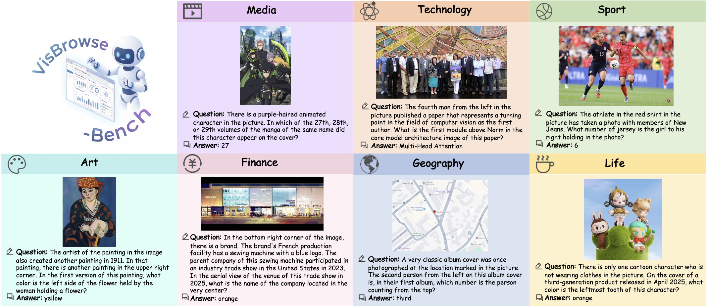
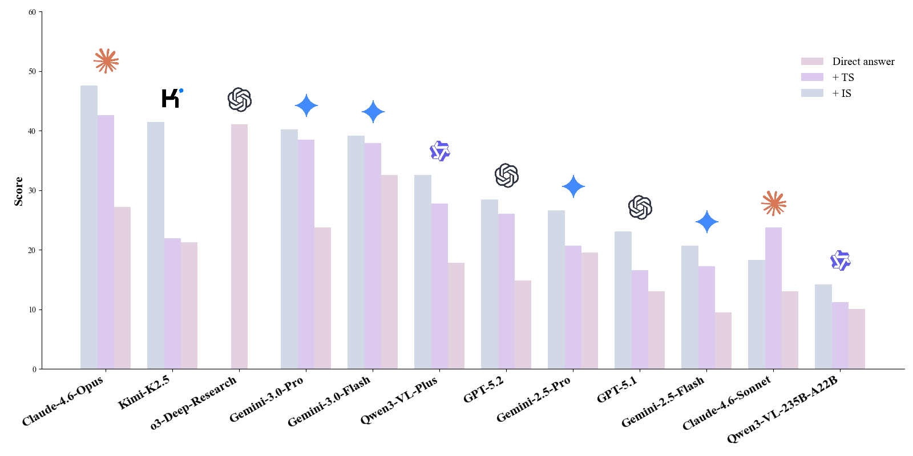
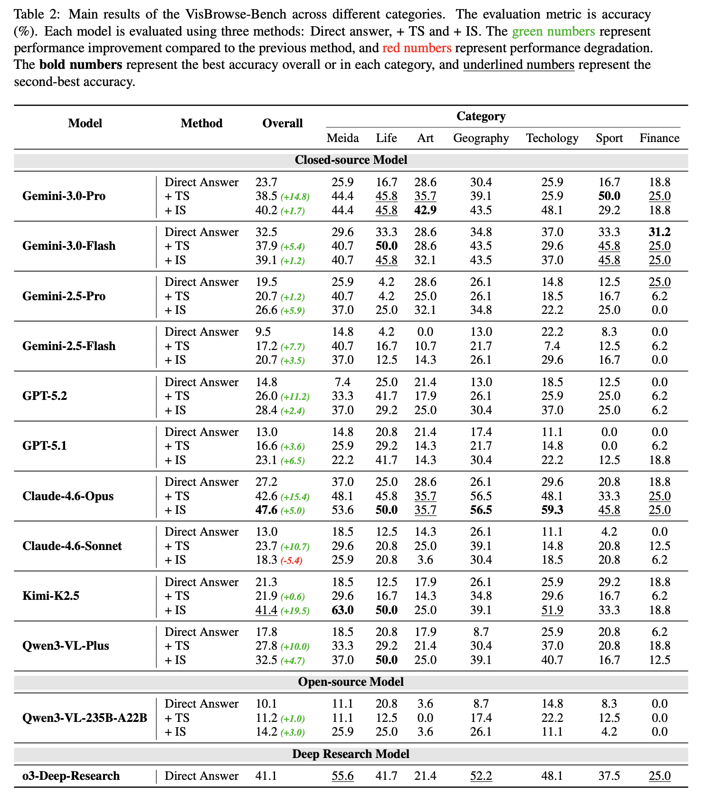

<div align='center'>
<h1>VisBrowse-Bench: Benchmarking Visual-Native Search for Multimodal Browsing Agents</h1>
</div>
<div align="center"> 

[](https://arxiv.org/abs/2603.16289)
[](https://huggingface.co/datasets/Zhengbo-Zhang/VisBrowse-Bench)

</div>


## 📣 News
- **[March 18, 2026]**: We release the VisBrowse-Bench data on **[huggingface](https://huggingface.co/datasets/Zhengbo-Zhang/VisBrowse-Bench)**!
- **[March 17, 2026]**: Our paper is now released on **[arXiv](https://arxiv.org/abs/2603.16289)**!

## 💡 About VisBrowse-Bench

We introduce a new benchmark for visual-native search, VisBrowse-Bench. It contains 169 VQA instances covering multiple domains and evaluates the models' visual reasoning capabilities during the search process through multimodal evidence cross-validation via text-image retrieval and joint reasoning.



## 🚀 Quick Start

1. **Decrypt the data**:

```bash
   python decrypt_data.py data/VisBrowse-Bench.jsonl data/VisBrowse-Bench_decrypted.jsonl
```

The `question` and `answer` fields in the dataset is encrypted, so you should decrypt them first.

2. **Model rollout**:

```bash
   bash run.sh
```

Before running the script, you should configure the following parameters in the `run.sh`:
- `--BASE_URL`: Base URL for the LLM service.
- `--API_KEY`: API key for the LLM service.
- `--MODEL_NAME`: Name of the LLM used to rollout.
- `--SUMMERY_MODEL_NAME`: Name of the LLM used to make summary in tool `visit`.
- `--SERPER_API_KEY`: API key for Serper.
- `--JINA_API_KEY`: API key for Jina.
- `--HF_TOKEN`: Access token of your Huggingface.
- `--HF_REPO_ID`: The repository to store the cropped images.

3. Evaluate the answer

```bash
   bash eval.sh
```

Before running the script, you should configure the following parameters in the `eval.sh`:
- `--BASE_URL`: Base URL for the LLM service.
- `--API_KEY`: API key for the LLM service.
- `--MODEL_NAME`: Name of the LLM used to judge.
- `--result_path`: File path of the rollout.
- `--judge_path`: Path to save the judgement.

## 📊 Performance




## 📄 Citation

If you find this modle useful in your research, please cite:
```bibtex
@misc{zhang2026visbrowsebenchbenchmarkingvisualnativesearch,
   title={VisBrowse-Bench: Benchmarking Visual-Native Search for Multimodal Browsing Agents}, 
   author={Zhengbo Zhang and Jinbo Su and Zhaowen Zhou and Changtao Miao and Yuhan Hong and Qimeng Wu and Yumeng Liu and Feier Wu and Yihe Tian and Yuhao Liang and Zitong Shan and Wanke Xia and Yi-Fan Zhang and Bo Zhang and Zhe Li and Shiming Xiang and Ying Yan},
   year={2026},
   eprint={2603.16289},
   archivePrefix={arXiv},
   primaryClass={cs.CV},
   url={https://arxiv.org/abs/2603.16289}, 
}
```